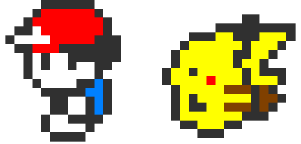

<p align="center">
  <hr>
</p>



```js
const aboutMe = {
  name: 'Allyson Belli Bogo',
  age: '32',
  rank: 'Web Developer',
  country: 'Brazil',
  softSkills: [
    'communication',
    'teamwork',
    'self-management',
    'resilience',
  ],
};
```

- 📖 I’m currently studying **Full Stack Web Development** at **Trybe**

- 📫 Fell free to contact me at **ab.bogo@gmail.com**

<h3 align="left">Where to find me?</h3>

<p align="left">
  <a href="https://linkedin.com/in/allysonbogo" title="LinkedIn"></a>
  <a href="https://fb.com/allysonbogo" title="Facebook"></a>
  <a href="https://www.instagram.com/bogoallyson" title="Instagram"></a>
</p>  

<h3 align="left">My toolbox</h3>

<a href="https://github.com/allysonbogo" title="JavaScript"></a>
<a href="https://github.com/allysonbogo" title="HTML"></a>
<a href="https://github.com/allysonbogo" title="CSS"></a>
<a href="https://github.com/allysonbogo" title="React"></a>
<a href="https://github.com/allysonbogo" title="VSCode"></a>

<a href="https://github.com/allysonbogo" title="Jest"></a>
<a href="https://github.com/allysonbogo" title="RTL"></a>
<a href="https://github.com/allysonbogo" title="Bootstrap"></a>
<a href="https://github.com/allysonbogo" title="Tailwind"></a>
<a href="https://github.com/allysonbogo" title="ESLint"></a>

<a href="https://github.com/allysonbogo" title="Git"></a>
<a href="https://github.com/allysonbogo" title="GitHub"></a>
<a href="https://github.com/allysonbogo" title="Figma"></a>
<a href="https://github.com/allysonbogo" title="Photoshop"></a>
<a href="https://github.com/allysonbogo" title="Trello"></a>

<!--
<h3 align="left">Stats</h3>

<a href="https://github.com/allysonbogo">
  
  
</a>
-->
